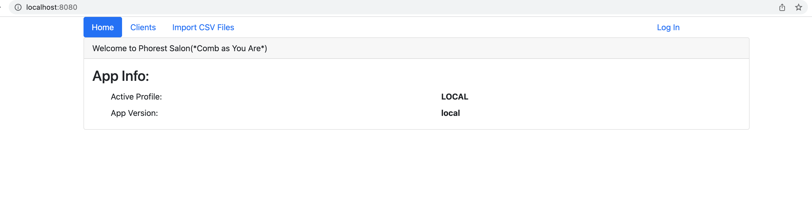
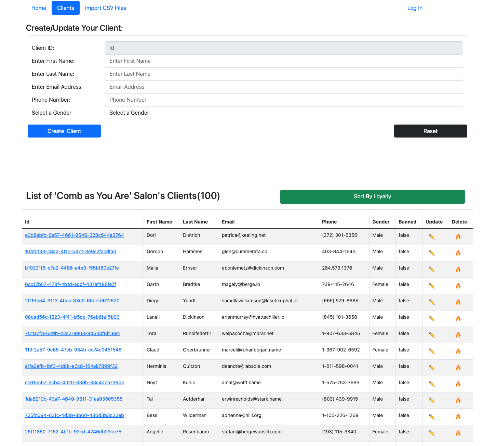
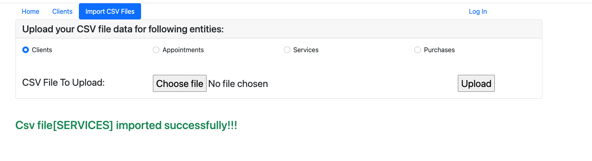

# Build and Run Salon Project Note

## Salon Project
* I have used Java(jdk17) , Gradle, Spring Boot, RESTFUL webservice withe GUI using Thymeleaf(https://www.thymeleaf.org/)
* I have used spring for IOC, Spring JPA and Spring Boot
* I used H2 Database Engine - it is good for rapid prototyping and development, but not suitable for production at least in most cases.
* Docker file
* Spring actuator

## Pages and Menu
Pages are used bootstrap 5 and using Thymeleaf layout and style. Tables are sortable.
- *Note*
  - At start up the spring boot application preload the app with CSV file provided. But you maybe disable it bye setting the property
    - preload: false
###Menu
#### Home Menu & Page
Show basic info about the app.
  
#### Clients Menu and Page
This the main page that list the clients and operate CRUD operation as bellow::
* Create Client
* Delete Client
* Update Client
* Sort Client By Loyally

  

#### Import CSV Files
This the  page that allow user to import all type of csv files(Clients, Appointments, Services, and Purchases).
This is an idempotent service. so allow mistake.

##Improvements If I need more time
- Authentication and Authorization
- Add Https and
- JUnit tests
- Use of swagger for API documentation
- User Heroku to host it and make it easy to test
- Following projects that I have in my Github account contain those features
  - https://github.com/gnaderi/CRO
  - https://github.com/gnaderi/IslandHopping
  - https://github.com/gnaderi/superhero

## To run the application
Use one of the several ways of running a Spring Boot application. Below are just three options:

1. Build using Gradle goal: `gradle bootRun` or run `gradle clean build` and then got to build folder to find artifact as follows `java -jar Salon*-SNAPSHOT.jar` or
2. Import the project in your IDE and run `java/com/naderi/phorest/salon/SalonApplication.java`  as a java app
3. Build and start as a Docker container. Instructions at: [Docker_README](Docker_README.md)

# REST APIs
* an endpoint to consume and parse csv files and import data into some database
  * Import Clients
    * `curl -X PUT -v -F csvFileCategory="CLIENT" -F csvFile="@/Users/gnaderi/IdeaProjects/phorest-techtest-ghodrat/DATA_FILES/clients.csv" http://localhost:8080/restapi/v1/upload-csv-file`
  * Import Appointments
    * `curl -X PUT -v -F csvFileCategory="APPOINTMENT" -F csvFile="@/Users/gnaderi/IdeaProjects/phorest-techtest-ghodrat/DATA_FILES/appointments.csv" http://localhost:8080/restapi/v1/upload-csv-file`
* an endpoint to list the top X number (endpoint parameter eg: 50) of clients that have accumulated the most loyalty points since Y date (endpoint parameter eg: 2018-01-01). Please exclude any banned clients.
  * `curl -i 'http://localhost:8080/restapi/v1/clients/top?date=2018-01-01&top=20'`

Nice to have: 
* at least one endpoint to update one of the entities
  * `curl -X PUT -H 'Cache-Control: no-cache' -H 'Content-Type: application/json' -d '{}' http://localhost:8080/restapi/v1/clients`
    * `curl -X PUT -H 'Cache-Control: no-cache' -H 'Content-Type: application/json' -d '{"id":"8f90ea2c-e518-4606-a02d-8c472973ea40","firstName":"GHODRAT","lastName":"NADERI","email":"sumikolynch@pollich.com","phone":"1-733-201-2652","gender":"Female","banned":true}' http://localhost:8080/restapi/v1/clients`
* an endpoint to fetch a single entity by id
  * `curl 'http://localhost:8080/restapi/v1/clients/{clientId}'`
    *  `curl 'http://localhost:8080/restapi/v1/clients/e0779fa6-7635-4df6-b906-d0d665ce5044'`
* an endpoint to delete one of the entities
  * `curl -X DELETE 'http://localhost:8080/restapi/v1/clients/{clientId}'`
    * `curl -X DELETE 'http://localhost:8080/restapi/v1/clients/e0779fa6-7635-4df6-b906-d0d665ce5044'`
    

## Testing
I believe I should it's done it, but I trust you know that I know how to write a good test suite!!!
I applied for EM role, and I think I am over qualified to do this project.
I have many of them in my GitHub account:
- https://github.com/gnaderi/CRO
- https://github.com/gnaderi/IslandHopping
- https://github.com/gnaderi/superhero